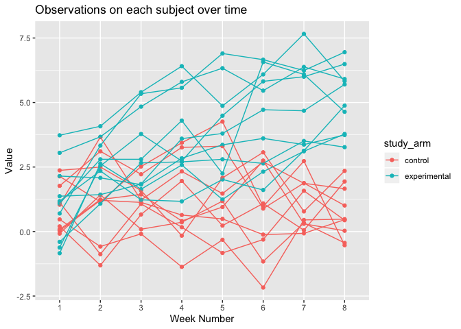
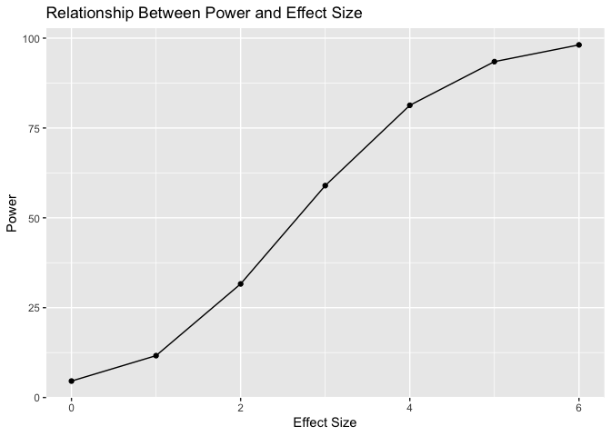

p8105\_hw5\_blm2156
================
Britney Mazzetta

# Problem 1

``` r
library(tidyverse)
```

    ## ── Attaching packages ────────────────── tidyverse 1.2.1 ──

    ## ✔ ggplot2 3.2.1     ✔ purrr   0.3.2
    ## ✔ tibble  2.1.3     ✔ dplyr   0.8.3
    ## ✔ tidyr   1.0.0     ✔ stringr 1.4.0
    ## ✔ readr   1.3.1     ✔ forcats 0.4.0

    ## ── Conflicts ───────────────────── tidyverse_conflicts() ──
    ## ✖ dplyr::filter() masks stats::filter()
    ## ✖ dplyr::lag()    masks stats::lag()

``` r
library(patchwork)

set.seed(10)

iris_with_missing = iris %>% 
  map_df(~replace(.x, sample(1:150, 20), NA)) %>%
  mutate(Species = as.character(Species)) %>%
  janitor::clean_names()

function1 = function(x) {
  
  if(is.numeric(x)) {
    replace_na(x, round(mean(x, na.rm = TRUE)))
  } else if (is.character(x)) {
    replace_na(x, "virginica")
  }
}

iris_final = map_df(iris_with_missing, function1)
iris_final
```

    ## # A tibble: 150 x 5
    ##    sepal_length sepal_width petal_length petal_width species
    ##           <dbl>       <dbl>        <dbl>       <dbl> <chr>  
    ##  1          5.1         3.5          1.4         0.2 setosa 
    ##  2          4.9         3            1.4         0.2 setosa 
    ##  3          4.7         3.2          1.3         0.2 setosa 
    ##  4          4.6         3.1          1.5         1   setosa 
    ##  5          5           3.6          1.4         0.2 setosa 
    ##  6          5.4         3.9          1.7         0.4 setosa 
    ##  7          6           3.4          1.4         0.3 setosa 
    ##  8          5           3.4          1.5         0.2 setosa 
    ##  9          4.4         2.9          1.4         0.2 setosa 
    ## 10          4.9         3.1          4           0.1 setosa 
    ## # … with 140 more rows

# Problem 2

``` r
problem2_files = list.files("./data/", full.names = TRUE)

p2_data = problem2_files %>%
  map(read_csv) %>%
  reduce(rbind) %>%
  mutate(
    subject_id = c(1:20),
    study_arm = ifelse(subject_id == c(1:10), "control", "experimental")) %>%
  select(subject_id, study_arm, everything())
```

    ## Parsed with column specification:
    ## cols(
    ##   week_1 = col_double(),
    ##   week_2 = col_double(),
    ##   week_3 = col_double(),
    ##   week_4 = col_double(),
    ##   week_5 = col_double(),
    ##   week_6 = col_double(),
    ##   week_7 = col_double(),
    ##   week_8 = col_double()
    ## )
    ## Parsed with column specification:
    ## cols(
    ##   week_1 = col_double(),
    ##   week_2 = col_double(),
    ##   week_3 = col_double(),
    ##   week_4 = col_double(),
    ##   week_5 = col_double(),
    ##   week_6 = col_double(),
    ##   week_7 = col_double(),
    ##   week_8 = col_double()
    ## )
    ## Parsed with column specification:
    ## cols(
    ##   week_1 = col_double(),
    ##   week_2 = col_double(),
    ##   week_3 = col_double(),
    ##   week_4 = col_double(),
    ##   week_5 = col_double(),
    ##   week_6 = col_double(),
    ##   week_7 = col_double(),
    ##   week_8 = col_double()
    ## )
    ## Parsed with column specification:
    ## cols(
    ##   week_1 = col_double(),
    ##   week_2 = col_double(),
    ##   week_3 = col_double(),
    ##   week_4 = col_double(),
    ##   week_5 = col_double(),
    ##   week_6 = col_double(),
    ##   week_7 = col_double(),
    ##   week_8 = col_double()
    ## )
    ## Parsed with column specification:
    ## cols(
    ##   week_1 = col_double(),
    ##   week_2 = col_double(),
    ##   week_3 = col_double(),
    ##   week_4 = col_double(),
    ##   week_5 = col_double(),
    ##   week_6 = col_double(),
    ##   week_7 = col_double(),
    ##   week_8 = col_double()
    ## )
    ## Parsed with column specification:
    ## cols(
    ##   week_1 = col_double(),
    ##   week_2 = col_double(),
    ##   week_3 = col_double(),
    ##   week_4 = col_double(),
    ##   week_5 = col_double(),
    ##   week_6 = col_double(),
    ##   week_7 = col_double(),
    ##   week_8 = col_double()
    ## )
    ## Parsed with column specification:
    ## cols(
    ##   week_1 = col_double(),
    ##   week_2 = col_double(),
    ##   week_3 = col_double(),
    ##   week_4 = col_double(),
    ##   week_5 = col_double(),
    ##   week_6 = col_double(),
    ##   week_7 = col_double(),
    ##   week_8 = col_double()
    ## )
    ## Parsed with column specification:
    ## cols(
    ##   week_1 = col_double(),
    ##   week_2 = col_double(),
    ##   week_3 = col_double(),
    ##   week_4 = col_double(),
    ##   week_5 = col_double(),
    ##   week_6 = col_double(),
    ##   week_7 = col_double(),
    ##   week_8 = col_double()
    ## )
    ## Parsed with column specification:
    ## cols(
    ##   week_1 = col_double(),
    ##   week_2 = col_double(),
    ##   week_3 = col_double(),
    ##   week_4 = col_double(),
    ##   week_5 = col_double(),
    ##   week_6 = col_double(),
    ##   week_7 = col_double(),
    ##   week_8 = col_double()
    ## )
    ## Parsed with column specification:
    ## cols(
    ##   week_1 = col_double(),
    ##   week_2 = col_double(),
    ##   week_3 = col_double(),
    ##   week_4 = col_double(),
    ##   week_5 = col_double(),
    ##   week_6 = col_double(),
    ##   week_7 = col_double(),
    ##   week_8 = col_double()
    ## )
    ## Parsed with column specification:
    ## cols(
    ##   week_1 = col_double(),
    ##   week_2 = col_double(),
    ##   week_3 = col_double(),
    ##   week_4 = col_double(),
    ##   week_5 = col_double(),
    ##   week_6 = col_double(),
    ##   week_7 = col_double(),
    ##   week_8 = col_double()
    ## )
    ## Parsed with column specification:
    ## cols(
    ##   week_1 = col_double(),
    ##   week_2 = col_double(),
    ##   week_3 = col_double(),
    ##   week_4 = col_double(),
    ##   week_5 = col_double(),
    ##   week_6 = col_double(),
    ##   week_7 = col_double(),
    ##   week_8 = col_double()
    ## )
    ## Parsed with column specification:
    ## cols(
    ##   week_1 = col_double(),
    ##   week_2 = col_double(),
    ##   week_3 = col_double(),
    ##   week_4 = col_double(),
    ##   week_5 = col_double(),
    ##   week_6 = col_double(),
    ##   week_7 = col_double(),
    ##   week_8 = col_double()
    ## )
    ## Parsed with column specification:
    ## cols(
    ##   week_1 = col_double(),
    ##   week_2 = col_double(),
    ##   week_3 = col_double(),
    ##   week_4 = col_double(),
    ##   week_5 = col_double(),
    ##   week_6 = col_double(),
    ##   week_7 = col_double(),
    ##   week_8 = col_double()
    ## )
    ## Parsed with column specification:
    ## cols(
    ##   week_1 = col_double(),
    ##   week_2 = col_double(),
    ##   week_3 = col_double(),
    ##   week_4 = col_double(),
    ##   week_5 = col_double(),
    ##   week_6 = col_double(),
    ##   week_7 = col_double(),
    ##   week_8 = col_double()
    ## )
    ## Parsed with column specification:
    ## cols(
    ##   week_1 = col_double(),
    ##   week_2 = col_double(),
    ##   week_3 = col_double(),
    ##   week_4 = col_double(),
    ##   week_5 = col_double(),
    ##   week_6 = col_double(),
    ##   week_7 = col_double(),
    ##   week_8 = col_double()
    ## )
    ## Parsed with column specification:
    ## cols(
    ##   week_1 = col_double(),
    ##   week_2 = col_double(),
    ##   week_3 = col_double(),
    ##   week_4 = col_double(),
    ##   week_5 = col_double(),
    ##   week_6 = col_double(),
    ##   week_7 = col_double(),
    ##   week_8 = col_double()
    ## )
    ## Parsed with column specification:
    ## cols(
    ##   week_1 = col_double(),
    ##   week_2 = col_double(),
    ##   week_3 = col_double(),
    ##   week_4 = col_double(),
    ##   week_5 = col_double(),
    ##   week_6 = col_double(),
    ##   week_7 = col_double(),
    ##   week_8 = col_double()
    ## )
    ## Parsed with column specification:
    ## cols(
    ##   week_1 = col_double(),
    ##   week_2 = col_double(),
    ##   week_3 = col_double(),
    ##   week_4 = col_double(),
    ##   week_5 = col_double(),
    ##   week_6 = col_double(),
    ##   week_7 = col_double(),
    ##   week_8 = col_double()
    ## )
    ## Parsed with column specification:
    ## cols(
    ##   week_1 = col_double(),
    ##   week_2 = col_double(),
    ##   week_3 = col_double(),
    ##   week_4 = col_double(),
    ##   week_5 = col_double(),
    ##   week_6 = col_double(),
    ##   week_7 = col_double(),
    ##   week_8 = col_double()
    ## )

``` r
p2_data
```

    ## # A tibble: 20 x 10
    ##    subject_id study_arm week_1 week_2 week_3 week_4 week_5 week_6 week_7
    ##         <int> <chr>      <dbl>  <dbl>  <dbl>  <dbl>  <dbl>  <dbl>  <dbl>
    ##  1          1 control     0.2  -1.31    0.66   1.96   0.23   1.09   0.05
    ##  2          2 control     1.13 -0.88    1.07   0.17  -0.83  -0.31   1.58
    ##  3          3 control     1.77  3.11    2.22   3.26   3.31   0.89   1.88
    ##  4          4 control     1.04  3.66    1.22   2.33   1.47   2.7    1.87
    ##  5          5 control     0.47 -0.580  -0.09  -1.37  -0.32  -2.17   0.45
    ##  6          6 control     2.37  2.5     1.59  -0.16   2.08   3.07   0.78
    ##  7          7 control     0.03  1.21    1.13   0.64   0.49  -0.12  -0.07
    ##  8          8 control    -0.08  1.42    0.09   0.36   1.18  -1.16   0.33
    ##  9          9 control     0.08  1.24    1.44   0.41   0.95   2.75   0.3 
    ## 10         10 control     2.14  1.15    2.52   3.44   4.26   0.97   2.73
    ## 11         11 experime…   3.05  3.67    4.84   5.8    6.33   5.46   6.38
    ## 12         12 experime…  -0.84  2.63    1.64   2.58   1.24   2.32   3.11
    ## 13         13 experime…   2.15  2.08    1.82   2.84   3.36   3.61   3.37
    ## 14         14 experime…  -0.62  2.54    3.78   2.73   4.49   5.82   6   
    ## 15         15 experime…   0.7   3.33    5.34   5.57   6.9    6.66   6.24
    ## 16         16 experime…   3.73  4.08    5.4    6.41   4.87   6.09   7.66
    ## 17         17 experime…   1.18  2.35    1.23   1.17   2.02   1.61   3.13
    ## 18         18 experime…   1.37  1.43    1.84   3.6    3.8    4.72   4.68
    ## 19         19 experime…  -0.4   1.08    2.66   2.7    2.8    2.64   3.51
    ## 20         20 experime…   1.09  2.8     2.8    4.3    2.25   6.57   6.09
    ## # … with 1 more variable: week_8 <dbl>

## Spaghetti Plot

``` r
p2_spaghetti = p2_data %>%
  pivot_longer(
  week_1:week_8,
  names_to = "week", 
  values_to = "value"
  ) %>% 
  separate(week,into = c("week_name", "week_number"), sep = 
  "_") %>%
  select(-week_name) %>%
  ggplot(aes(x = week_number, y = value, color = study_arm, group=subject_id)) + 
  geom_point() + 
  geom_line() +
  labs(
    title = "Activity over course of day",
    x = "Week Number",
    y = "Value")
p2_spaghetti
```

<!-- --> \#
Problem 3

``` r
set.seed(1)

sim_regression = function(n= 30, beta0 = 2, beta1 = 0) {
 prob3 = tibble(
    x = rnorm(n, mean = 0, sd = 1), 
    y = beta0 + beta1 * x + rnorm(n, 0, sqrt (50))
  )

ls_fit = lm(y ~ x, data = prob3) %>%
  broom::tidy ()

tibble(
  beta1_hat = ls_fit[[2,2]],
  p_value = ls_fit [[2,5]]
)

}
```

``` r
prob3_final = rerun(10000, sim_regression(beta1 = 0)) %>% 
  bind_rows()
```

``` r
prob3_final2 = 
  tibble(beta1_new = c(1,2,3,4,5,6)) %>%
  mutate(
    output_lists = map(.x = beta1_new, ~rerun(10000, sim_regression(beta1 = .x))),
    estimate_dfs = map(output_lists, bind_rows)) %>%
  select (-output_lists) %>%
  unnest(estimate_dfs)
```

## Results

``` r
p3_plot1 = prob3_final2 %>%
  mutate(reject = ifelse(p_value <= 0.05, "Not Significant", "Significant")) %>%
  group_by(beta1_new, reject) %>%
  summarize(rejection_count = n()) %>%
  filter(reject == "Not Significant") %>%
  mutate(rejection_rate = rejection_count/100) %>%
ggplot(aes(x = beta1_new, y = rejection_rate)) + 
    geom_point() +
    geom_smooth() + 
    labs(
    title = "Relationship Between Power and expression(beta[1])",
    x = "True Value of expression(beta[1])",
    y = "Power")
p3_plot1
```

    ## `geom_smooth()` using method = 'loess' and formula 'y ~ x'

    ## Warning in simpleLoess(y, x, w, span, degree = degree, parametric =
    ## parametric, : Chernobyl! trL>n 6
    
    ## Warning in simpleLoess(y, x, w, span, degree = degree, parametric =
    ## parametric, : Chernobyl! trL>n 6

    ## Warning in sqrt(sum.squares/one.delta): NaNs produced

    ## Warning in stats::qt(level/2 + 0.5, pred$df): NaNs produced

<!-- -->
